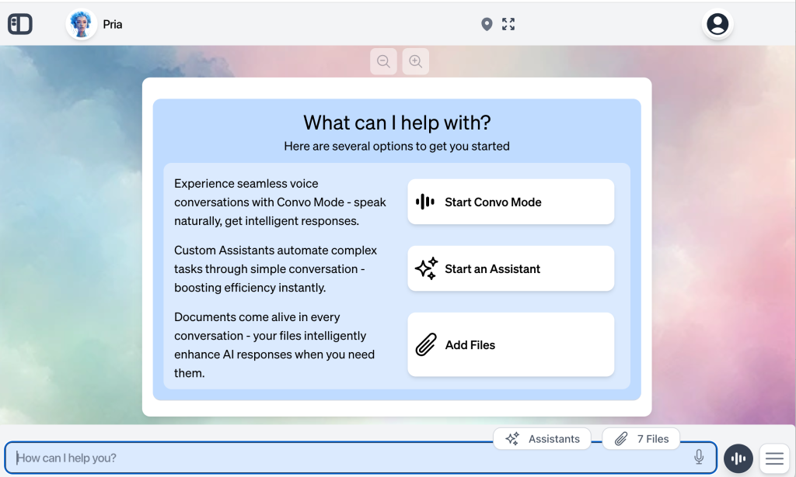

## Main Screen
This is the main screen where you will interact with me:

:::note
The background color, logo and my personality may change based on your institution or school, but the elements of the user interface (UI) are the same.
:::

On the top toolbar, click the digital expert logo to get back to this screen at any time. On the right, you can request the UI to be in Full-Screen mode.

Click on your icon to access additional menu items, such as My Profile, Add Credits, Change Password, Referrals, Help, Terms, Privacy, and to log out when this application is running in standalone mode.

Let’s get started!

- **User Guide**
  - **Welcome to the world of Generative AI +**
    - Main Screen
  - **My Profile**
    - Switch Accounts
    - Edit Profile
    - Change Password
    - Provide Feedback
    - Add Credits
  - **Interaction**
    - Input Prompt
    - My Response
    - Speech to Text
    - Convo Mode
  - **History, Left Nav Bar, Favorites and Settings**
    - Conversation History
    - Loading more history
    - Left Navigation Bar
    - Listing Conversations
  - What can I do?
  - **Content Creation**
    - Image Generation
    - Sharing A Dialogue
    - Content Generation
    - Resource Locator (Links and Videos)
    - Finding Images
    - Content Summarization
    - Content Download
  - Assistants
  - **Files Management**
    - Upload Files
    - Upload Pages (URL)
    - My Files
    - RAG: Search Vectors
  - **Media Handling**
    - Image Analysis
    - Extracting Text from Audio and Videos
    - Youtube Transcripts
    - Play Videos on Youtube
    - Play Audio and Video Files
    - Finding Sounds
  - **Technical Assistance**
    - Writing Code
    - BLAST Feature
    - Generate SVG icons
    - Prompts for Software Developer
    - Dataset Analysis
    - 2D Charting
  - **Advanced Features**
    - LMS Integration
    - Conversational Assessment
    - User Memory
    - Scientific Notations
    - Putting it together