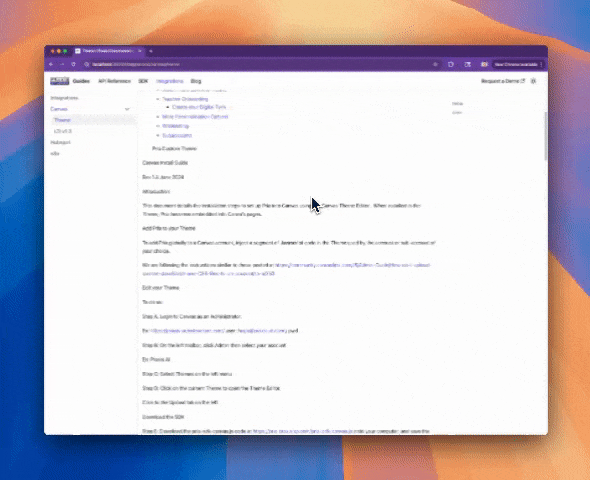

Praxis AI is designed to seamlessly fit into your existing digital learning and administrative ecosystem. We offer powerful integrations with a range of third-party platforms—enabling institutions to enhance learning experiences, streamline operations, and unlock the full potential of AI-driven personalization.

Whether you’re managing content delivery through your LMS, syncing user data from identity providers, embedding virtual labs, or analyzing learner engagement via analytics tools—Praxis AI provides the flexibility and extensibility to connect where you need it most.

What You’ll Find in This Section

In this Integrations section, you’ll discover:
	•	Supported Platforms: Out-of-the-box integrations with popular LMS platforms like Canvas, Blackboard, and Moodle, as well as identity providers such as Okta and Azure AD.
	•	LTI & SSO Setup Guides: Step-by-step instructions for configuring Learning Tools Interoperability (LTI) and Single Sign-On (SSO) connections.
	•	Data Syncing & APIs: Options for automated user provisioning, cohort mapping, and data exchange using secure RESTful APIs.
	•	Third-Party Tool Compatibility: Details on connecting to services like Zoom, Slack, Jupiter Notebooks, Toolwire VDI, and more.
	•	Best Practices & Troubleshooting: Guidance to ensure optimal performance and reliable integration behavior.

Praxis AI was built with interoperability in mind—so you can bring your existing tools along for the journey while scaling your AI-enhanced education experiences.