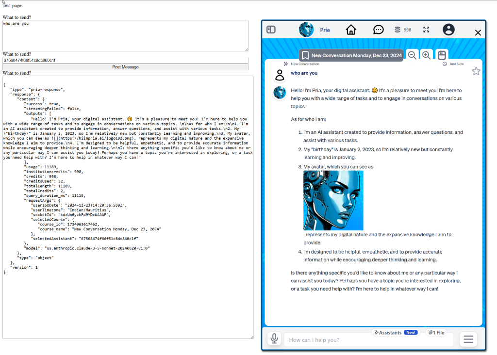
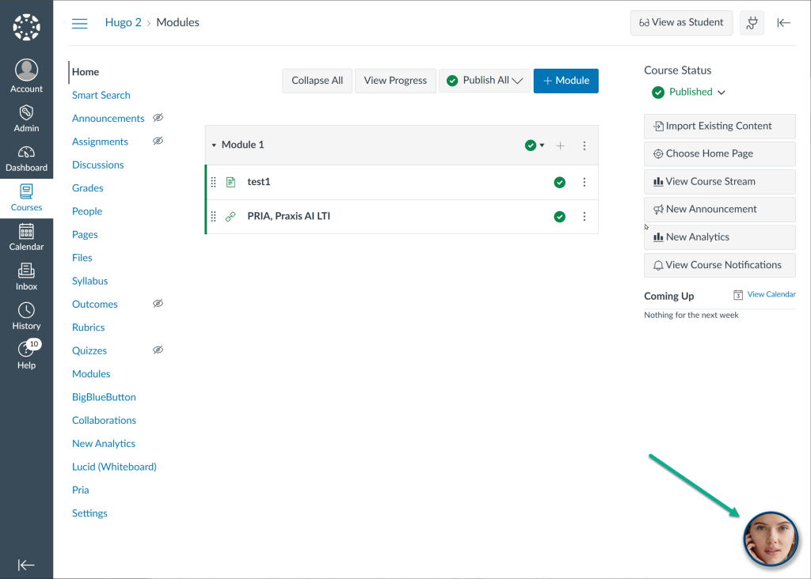

https://gitlab.com/praxis-ai/pria-client-sdk


# JavaScript SDK

## Introduction

Once you have installed Pria onto your website (or LMS such as Canvas), you can communicate with Pria through JavaScript. This document describes how to make requests to Pria and receive responses from Pria, without requiring the Pria UI.

Here is an example UI we created for this documentation.





Example code at: [https://pria.praxislxp.com/test_sdk.html](https://pria.praxislxp.com/test_sdk.html)

## Pria’s JavaScript Client SDK

### Embed Pria

Install Pria on your website using the custom SDK:

[https://pria.praxislxp.com/pria-sdk-web.js](https://pria.praxislxp.com/pria-sdk-web.js)

Or follow this guide to install Pria as a Theme onto Canvas:

[https://learning.praxislxp.com/praxis/pria-custom-theme-canvas-install-guide](https://learning.praxislxp.com/praxis/pria-custom-theme-canvas-install-guide)

Once your instance is configured, and to hide the Pria UI, set the display options of the `priasdk` to `noUI=true` value.

### Pria SDK

Pria SDK is available as a window global object and contains the following functions:

### Make a Simple Request

To send a request to Pria, use the `send()` function.

When Pria is installed and running, Pria will be available in your page like the example below:



In this example, features Pria named as ‘Scarlet’ which is a custom Digital Twin.

At the time of this writing, Pria `send()` API function SDK supports the following commands:

- `post.message`: Sends a text message to Pria
- `convo.start`: Sends a request to start the Conversational feature Speech to Speech
- `convo.stop`: Sends a request to stop the Conversational feature Speech to Speech

Anywhere in the DOM of your web page, you can send requests to Pria using a simple JavaScript code like this:

```javascript
const request = {
  command: 'post.message',
  inputs: ['How are you?', 'Today is my birthday!'],
};

pria.send(request);
```

The function `pria.send` may throw errors such as: “Connect Pria first, then retry”, and “Function requires valid JSON.”

The SDK uses the identity of the user currently connected to the digital twin.

Pria will only respond when the digital twin is properly configured and fully connected.

Here is an example to start the Convo feature:

```javascript
const request = {
  command: 'convo.start',
};

pria.send(request);
```

Here is an example to stop the Convo feature:

```javascript
const request = {
  command: 'convo.stop',
};

pria.send(request);
```

### Receive Responses

To receive a response from Pria, you must subscribe first.

This is done using the `pria.subscribe` function like the following example:

```javascript
const gotResponseFromPria = (response) => {
  // Handle the response
};

pria.subscribe(gotResponseFromPria);
```

The `gotResponseFromPria` is a JavaScript function of your liking that will be called by Pria when a response message is ready.

Internally, the client SDK handles an array of subscribers, so you can register more than one function to handle responses.

### Typical Response

A typical response looks like this JSON object:

```json
{
  "type": "pria-response",
  "response": {
    "command": "post.message",
    "content": {
      "success": true,
      "outputs": ["I am doing great! Happy birthday by the way.."],
      "usage": 12048,
      "query_duration_ms": 9404,
      "model": "us.anthropic.claude-3-5-sonnet-20240620-v1:0"
    },
    "isError": false,
    "type": "object"
  },
  "version": 1
}
```

```json
{
  "type": "pria-response",
  "response": {
    "content": "Unauthorized",
    "command": "convo.start",
    "type": "string",
    "isError": true
  },
  "version": 1
}
```

```json
{
  "type": "pria-response",
  "response": {
    "content": "Convo stopped (STS)",
    "command": "convo.stop",
    "type": "string",
    "isError": false
  },
  "version": 1
}
```

```json
{
  "type": "pria-response",
  "response": {
    "content": [
      {
        "_id": "67568474f66f51c8dc860c1f",
        "name": "New Conversation",
        "description": "Start a new conversation! This assistant is designed to initiate and facilitate fresh, engaging dialogues on a wide range of topics, adapting to the user's interests and needs.✏️ It employs a dynamic approach, utilizing available tools and user memory to personalize interactions, while maintaining a focus on the current conversation's context and goals. The primary benefit of this assistant is its ability to provide tailored, informative, and thought-provoking exchanges that encourage learning, exploration, and meaningful engagement."
      }
    ],
    "command": "post.message",
    "type": "array",
    "isError": false
  },
  "version": 1
}
```
