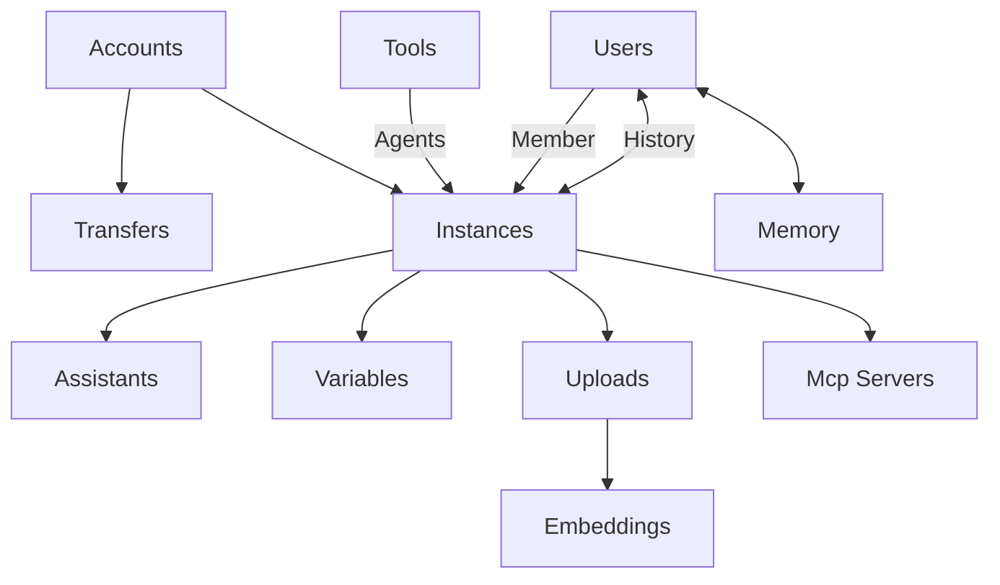

<iframe className="w-full aspect-video rounded-xl" src="https://player.vimeo.com/video/1100475061?badge=0&autopause=0&player_id=0&amp" title="YouTube video player" frameBorder="0" allow="accelerometer; autoplay; clipboard-write; encrypted-media; gyroscope; picture-in-picture" allowFullScreen />

Praxis AI empowers organizations to deploy Digital Experts: intelligent, customizable AI consultants with distinct personalities, voices, and specialized knowledge.

Backed by secure, isolated IPVaults and Retrieval-Augmented Generation (RAG), each Digital Expert works autonomously while protecting sensitive information. With multi-modal interaction, tool integrations, and model flexibility, your team can scale effortlessly—turning AI from a tool into a trusted teammate.

## Scalable Hierarchy

Like a well-conducted symphony, every part of your AI organization plays in harmony. The organizational account is the conductor, guiding multiple Digital Experts as sections of the orchestra, each with their own assistants as individual instruments. Together, they create a seamless performance—precise, adaptable, and perfectly in tune with your goals.

## Secure IP Vaults

Praxis AI maintains enterprise-grade security with SOC 2 compliance and bank-level encryption. Your data is protected through end-to-end encryption for all transmission and storage, role-based access controls ensuring only authorized users can access specific information, and multi-tenant architecture with isolated environments for each organization.

We maintain compliance with educational standards like FERPA and COPPA while providing comprehensive data governance tools for all users. Our IP Vault technology keeps your proprietary content secure while enabling AI training, and we conduct regular security audits and penetration testing to ensure your information remains protected.